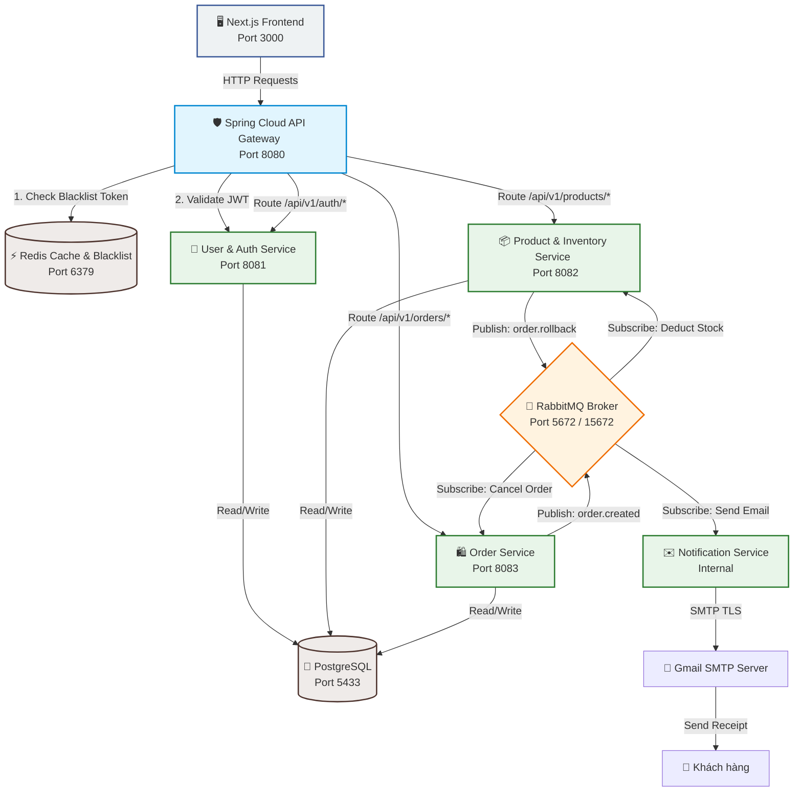

# 🛒 Hệ Thống Thương Mại Điện Tử Microservices (E-Commerce System)

> **Báo cáo đồ án môn học:** Phát triển hệ thống phân tán / Kiến trúc phần mềm phân tán
> 
> **Công nghệ sử dụng:** Spring Boot Microservices, Next.js (Frontend), Spring Cloud Gateway, RabbitMQ (Message Broker), Redis (Caching & Security), PostgreSQL (Multi-database).

---

## 🏛️ 1. Tổng Quan Kiến Trúc Hệ Thống

Hệ thống được thiết kế theo kiến trúc **Microservices** hiện đại, tách biệt hoàn toàn trách nhiệm giữa các dịch vụ (Single Responsibility Principle) và sử dụng cơ sở dữ liệu riêng biệt cho từng service nhằm đảm bảo tính độc lập và khả năng mở rộng (Database per Service).

### 📊 Sơ đồ kiến trúc & luồng dữ liệu (System Architecture)



---

## ⚡ 2. Danh Sách Các Dịch Vụ & Chức Năng Chi Tiết

Hệ thống bao gồm 5 microservices backend phát triển bằng **Java (Spring Boot / Maven)** và 1 ứng dụng khách bằng **Next.js (TypeScript)**:

### 1. 🛡️ API Gateway (`api-gateway` - Cổng 8080)
*   **Chức năng:** Là ngõ vào duy nhất (Single Entry Point) cho toàn bộ request từ Client.
*   **Bảo mật:** Tích hợp `AuthenticationFilter` để kiểm tra và xác thực JWT token.
*   **Tối ưu hóa trạng thái đăng xuất (Logout):** Xử lý đăng xuất trực tiếp tại Gateway bằng cách đưa JWT token vào **Redis Blacklist** với thời gian sống (TTL) xác định, vô hiệu hóa token ngay lập tức mà không cần gọi sâu vào dịch vụ xác thực.
*   **Chia sẻ Context:** Sau khi xác thực thành công, Gateway tự động đính kèm thông tin danh tính người dùng (`X-User-Id`, `X-User-Username`, `X-User-Role`) vào Request Header trước khi chuyển tiếp (downstream) đến các service nội bộ.

### 2. 👤 User & Identity Service (`user-service` - Cổng 8081)
*   **Quản lý người dùng:** Đăng ký, Đăng nhập, phân quyền Role-based Access Control (RBAC) chặt chẽ (Admin vs. Customer).
*   **Hồ sơ cá nhân:** Cung cấp API cập nhật thông tin cá nhân và quản lý sổ địa chỉ giao hàng (Shipping Address), tối ưu hóa luồng thanh toán nhanh.
*   **Xác thực mã nguồn:** Sinh và kiểm tra chữ ký điện tử của JWT.

### 3. 📦 Product & Inventory Service (`product-service` - Cổng 8082)
*   **Danh mục sản phẩm:** Quản lý sản phẩm, thông tin chi tiết, giá cả và danh mục hàng hóa.
*   **Quản lý kho:** Theo dõi số lượng tồn kho của từng sản phẩm.
*   **Xử lý bất đồng bộ:** Lắng nghe sự kiện tạo đơn hàng từ RabbitMQ để tự động khấu trừ số lượng sản phẩm trong kho. Nếu kho không đủ, dịch vụ sẽ gửi sự kiện hủy bỏ lên RabbitMQ để khôi phục trạng thái.

### 4. 🛍️ Order Service (`order-service` - Cổng 8083)
*   **Đặt hàng:** Cho phép người dùng tạo đơn hàng từ giỏ hàng, tự động tính tổng tiền.
*   **Quy trình nghiệp vụ (Saga Pattern dạng đơn giản):**
    *   Khi tạo đơn hàng ở trạng thái `PENDING`, service phát hành sự kiện `order.created` qua RabbitMQ.
    *   Nếu nhận được phản hồi tồn kho đủ từ `product-service`, đơn hàng chuyển thành `CONFIRMED`.
    *   Nếu nhận được sự kiện lỗi hoặc hết hàng (`order.rollback`), đơn hàng chuyển thành `CANCELLED` để hoàn trả giao dịch.

### 5. ✉️ Notification Service (`notification-service` - Chạy nội bộ)
*   **Nhận sự kiện:** Lắng nghe tin nhắn qua hàng đợi RabbitMQ từ hệ thống đặt hàng.
*   **Gửi Email tự động:** Tự động kết nối tới máy chủ SMTP Gmail để gửi thư xác nhận đặt hàng thành công đến địa chỉ Email của khách hàng, đính kèm đầy đủ hóa đơn chi tiết đơn hàng trực quan, chuyên nghiệp.

### 6. 🖥️ Frontend Web Application (`frontend-web` - Cổng 3000)
*   **Giao diện người dùng:** Viết bằng Next.js hiện đại, sử dụng cơ chế Client-side Rendering kết hợp Context API quản lý trạng thái tập trung.
*   **Trải nghiệm khách hàng:** Giao diện mua sắm mượt mà, bộ lọc sản phẩm thông minh, trang quản lý thông tin tài khoản, tích hợp địa chỉ giao hàng mặc định vào giỏ hàng và lịch sử đơn hàng trực quan.

---

## 🛠️ 3. Hướng Dẫn Cài Đặt & Khởi Chạy Hệ Thống

Hệ thống đã được đóng gói hoàn chỉnh bằng **Docker & Docker Compose**, giảng viên chỉ cần thực hiện vài bước đơn giản để khởi chạy toàn bộ ứng dụng mà không cần cấu hình thủ công từng công nghệ.

### 📋 Yêu cầu hệ thống (Prerequisites)
1.  **Docker Desktop** đã được cài đặt và đang chạy (hỗ trợ cả Docker Engine và Docker Compose).
2.  **Cung cấp kết nối Internet** để Docker tải các image cần thiết trong lần chạy đầu tiên.

### 🚀 Các bước khởi chạy hệ thống

#### **Bước 1: Cấu hình biến môi trường (`.env`)**
Tại thư mục gốc của dự án, bạn sẽ thấy file `.env`. File này cấu hình tài khoản SMTP Gmail dùng để gửi mail thông báo đơn hàng.
*(Nếu muốn trải nghiệm tính năng gửi Email thực tế, vui lòng cấu hình bằng tài khoản Gmail của bạn và tạo Mật khẩu ứng dụng - App Password)*:

```env
SMTP_USERNAME=your-email@gmail.com
SMTP_PASSWORD=your-app-password
```

#### **Bước 2: Xây dựng và Khởi chạy bằng Docker Compose**
Mở Terminal/PowerShell tại thư mục gốc của dự án (`CHTPT-Code`) và chạy lệnh sau để tự động tải các thư viện, build mã nguồn Java & Next.js thành Docker image và khởi chạy các container:

```bash
docker-compose up -d --build
```

> **💡 Giải thích tham số:**
> *   `up`: Khởi chạy các container được định nghĩa trong file `docker-compose.yml`.
> *   `-d` (detached mode): Chạy ngầm ứng dụng dưới nền để giải phóng cửa sổ terminal.
> *   `--build`: Ép buộc Docker biên dịch lại mã nguồn mới nhất của các microservices trước khi chạy.

#### **Bước 3: Kiểm tra trạng thái hoạt động**
Sau khi lệnh chạy hoàn tất, bạn có thể kiểm tra danh sách container đang chạy bằng lệnh:

```bash
docker ps
```
Hoặc kiểm tra trên giao diện trực quan của **Docker Desktop**. Các service cần đảm bảo hiển thị trạng thái `Running` (hoặc `Healthy` đối với PostgreSQL và RabbitMQ).

---

## 🔗 4. Địa Chỉ Truy Cập Dịch Vụ & Quản Trị

| Tên Dịch Vụ / Công Cụ | Cổng Vật Lý (Port) | Địa Chỉ URL Truy Cập / Kết Nối | Tài Khoản Mặc Định (Nếu có) |
| :--- | :---: | :--- | :--- |
| **🖥️ Frontend Web App** | `3000` | [http://localhost:3000](http://localhost:3000) | Tự do đăng ký tài khoản mới |
| **🛡️ API Gateway** | `8080` | [http://localhost:8080](http://localhost:8080) | Điểm đầu mối của các API |
| **🐇 RabbitMQ Web Admin** | `15672` | [http://localhost:15672](http://localhost:15672) | Username: `guest` <br> Password: `guest` |
| **🐘 PostgreSQL Database** | `5433` | `localhost:5433` (Kết nối ngoài) | User: `postgres` <br> Pass: `yoursecurepassword` |
| **⚡ Redis Cache Server** | `6379` | `localhost:6379` | Không mật khẩu (Nội bộ) |

---

## 📈 5. Kịch Bản Kiểm Thử Hệ Thống (Demo Flow)

Để giúp giảng viên dễ dàng đánh giá toàn bộ hoạt động phân tán của hệ thống, dưới đây là kịch bản kiểm thử tích hợp chuẩn:

1.  **Đăng ký & Đăng nhập (Security Flow):**
    *   Truy cập [http://localhost:3000](http://localhost:3000), tiến hành Đăng ký tài khoản khách hàng mới.
    *   Đăng nhập tài khoản vừa tạo. Token JWT sẽ được sinh ra ở backend, lưu trữ ở Client và tự động đính kèm vào Header `Authorization: Bearer <token>` cho mọi request tiếp theo.
2.  **Cập nhật Hồ sơ & Địa chỉ (Context Sync):**
    *   Vào trang quản lý tài khoản cá nhân, điền địa chỉ giao hàng và số điện thoại. Thông tin này sẽ tự động hiển thị trong biểu mẫu thanh toán khi mua hàng.
3.  **Đặt hàng & Trừ kho (Distributed Transaction & Saga Flow):**
    *   Quay lại trang chủ, chọn sản phẩm và thêm vào Giỏ hàng.
    *   Nhấn **Đặt hàng**. Lúc này:
        *   `order-service` tạo đơn hàng trạng thái `PENDING` và bắn tin nhắn sang RabbitMQ.
        *   `product-service` nhận tin, trừ số lượng tồn kho tương ứng của sản phẩm rồi xác nhận thành công.
        *   `order-service` cập nhật trạng thái đơn hàng thành `CONFIRMED`.
4.  **Thông báo Email (Notification Flow):**
    *   `notification-service` tiêu thụ tin nhắn từ RabbitMQ, tự động lấy thông tin Email khách hàng từ `user-service`, dựng mẫu hóa đơn và gửi trực tiếp tới email khách hàng qua SMTP.
5.  **Đăng xuất và Vô hiệu hóa Token (Redis Blacklist Flow):**
    *   Nhấn **Đăng xuất**. API Gateway chặn đứng request logout này, ghi nhận chữ ký token đó vào **Redis Blacklist** với thời gian tồn tại 24 giờ.
    *   Nếu cố tình dùng lại token cũ đó gửi request qua Postman, API Gateway lập tức phản hồi mã lỗi `401 Unauthorized` kèm thông báo *"Token is revoked"* mà không cần truy vấn tới Database hay chuyển tiếp xuống dưới.

---

> [!NOTE]
> Hệ thống áp dụng cấu trúc phân tách rõ ràng giúp mã nguồn cực kỳ sáng sủa và dễ bảo trì. Các cơ chế phục hồi lỗi khi quá tải hoặc mất mạng giữa các container được kiểm soát an toàn nhờ cơ chế `healthcheck` thông minh của Docker Compose.
